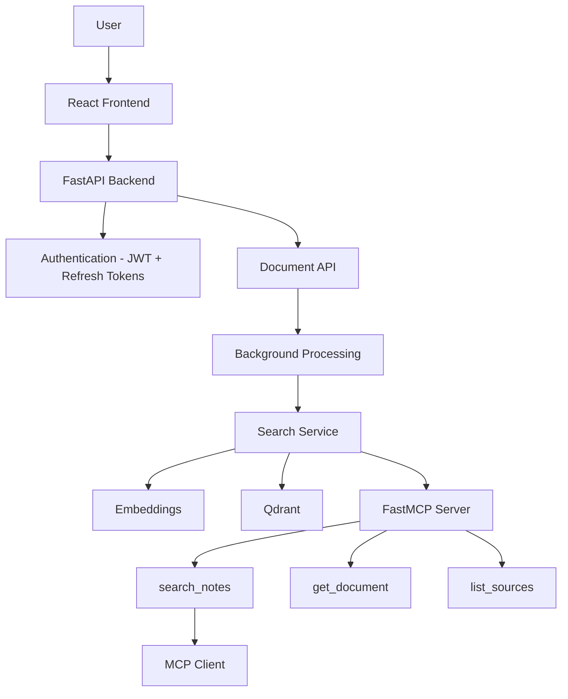

# Personal Knowledge Base MCP

A multi-user personal knowledge base powered by semantic search, Qdrant, FastAPI, and FastMCP, exposing document search through MCP tools to any MCP-compatible AI client.

## Overview

Upload your own documents (PDF, TXT, Markdown, DOCX, PPT/PPTX), and search across them with natural-language questions using real semantic (vector) search — not keyword matching. Each user's documents and search results are fully isolated from every other user, enforced at the database and vector-store level. An MCP server exposes the same search capability as tools (`search_notes`, `get_document`, `list_sources`) so any MCP-compatible AI client (e.g. Claude Desktop) can query your knowledge base directly.

The application includes production-oriented authentication (refresh tokens, password reset, rate limiting), background document processing with real status tracking, pagination, and a modern React frontend.

## Architecture



The `SearchService` (`backend/app/services/search_service.py`) is the single shared implementation used by both the `/search` HTTP route and the MCP tools — there is no duplicated Qdrant logic between the two.

## Data flow

Document upload
↓
Metadata record created (status: uploading)
↓
Background task starts (request returns immediately)
↓
Text Extraction (loader.py)
↓
Chunking, paragraph/sentence-aware (chunker.py)
↓
Embeddings (embedder.py, multi-qa-MiniLM-L6-cos-v1)
↓
Qdrant (per-user filtered vector store, with payload indexes)
↓
status: indexed (or failed, with error_message)
↓
Semantic Search (search_service.py) — filterable by file type / document
↓
FastAPI / FastMCP tools
↓
Frontend / MCP Client


## Folder Structure

```text
personal-knowledge-base-mcp/
│
├── backend/
│   ├── app/
│   │   ├── main.py
│   │   │   └── FastAPI app, routers, CORS, rate limiter
│   │   │
│   │   ├── api/
│   │   │   ├── auth.py
│   │   │   │   └── Register, login, refresh, logout, forgot/reset/change password
│   │   │   ├── documents.py
│   │   │   │   └── Upload, list, get, delete documents
│   │   │   ├── search.py
│   │   │   │   └── Semantic search with file/document filters
│   │   │   └── health.py
│   │   │       └── Health checks for API, database, and Qdrant
│   │   │
│   │   ├── core/
│   │   │   ├── config.py
│   │   │   │   └── Environment-based application settings
│   │   │   ├── database.py
│   │   │   │   └── SQLAlchemy engine and session
│   │   │   ├── dependencies.py
│   │   │   │   └── Current-user dependency
│   │   │   ├── security.py
│   │   │   │   └── Password hashing, JWT, refresh/reset tokens
│   │   │   └── rate_limit.py
│   │   │       └── SlowAPI rate limiter
│   │   │
│   │   ├── models/
│   │   │   ├── user.py
│   │   │   ├── document.py
│   │   │   ├── knowledge.py
│   │   │   ├── refresh_token.py
│   │   │   └── password_reset_token.py
│   │   │
│   │   ├── ingestion/
│   │   │   ├── loader.py
│   │   │   │   └── PDF, DOCX, PPTX, TXT, and Markdown extraction
│   │   │   ├── chunker.py
│   │   │   │   └── Paragraph and sentence-aware chunking
│   │   │   ├── embedder.py
│   │   │   │   └── SentenceTransformer wrapper
│   │   │   └── processor.py
│   │   │       └── Extract → chunk → embed → store
│   │   │
│   │   ├── database/
│   │   │   └── qdrant_client.py
│   │   │       └── Qdrant manager, user filtering, payload indexes
│   │   │
│   │   └── services/
│   │       └── search_service.py
│   │           └── Shared semantic-search implementation
│   │
│   ├── mcp_server/
│   │   ├── server.py
│   │   │   └── FastMCP app and tool registration
│   │   ├── tools.py
│   │   │   └── MCP tools → SearchService
│   │   └── schemas.py
│   │
│   ├── alembic/
│   │   └── Database schema migrations
│   │
│   ├── tests/
│   │   ├── test_api.py
│   │   ├── test_auth_v2.py
│   │   ├── test_documents_v2.py
│   │   ├── test_mcp_tools.py
│   │   └── test_mcp_live.py
│   │
│   ├── Dockerfile
│   ├── requirements.txt
│   └── .env.example
│
└── frontend/
    ├── src/
    │   ├── api/
    │   │   └── client.js
    │   │       └── Fetch wrapper, token refresh, error handling
    │   │
    │   ├── components/
    │   │   ├── Nav.jsx
    │   │   ├── Modal.jsx
    │   │   ├── Toast.jsx
    │   │   └── RequireAuth.jsx
    │   │
    │   ├── pages/
    │   │   ├── Login.jsx
    │   │   ├── Register.jsx
    │   │   ├── ForgotPassword.jsx
    │   │   ├── ResetPassword.jsx
    │   │   ├── Dashboard.jsx
    │   │   ├── UploadDocuments.jsx
    │   │   ├── MyDocuments.jsx
    │   │   ├── DocumentView.jsx
    │   │   ├── Search.jsx
    │   │   ├── SearchResults.jsx
    │   │   └── Settings.jsx
    │   │
    │   ├── styles/
    │   ├── App.jsx
    │   └── main.jsx
    │
    ├── vercel.json
    ├── index.html
    └── vite.config.js
```

## Installation

### Backend

```bash
cd backend
python -m venv .venv
source .venv/bin/activate   # Windows: .venv\Scripts\activate
pip install -r requirements.txt
cp .env.example .env        # then edit SECRET_KEY etc.
alembic upgrade head        # creates/updates the database schema
```

### Frontend

```bash
cd frontend
npm install
```

## Environment setup

Copy `backend/.env.example` to `backend/.env` and adjust as needed. Never commit `.env`.

Key variables:
- `SECRET_KEY` — set a real random secret in production.
- `ACCESS_TOKEN_EXPIRE_MINUTES` / `REFRESH_TOKEN_EXPIRE_DAYS` — short-lived access token (default 15 min), long-lived revocable refresh token (default 7 days).
- `QDRANT_IN_MEMORY=true` — no persistence, good for quick local testing. `false` for a real Qdrant server (local Docker or Qdrant Cloud).
- `QDRANT_API_KEY` / `QDRANT_USE_HTTPS` — required for Qdrant Cloud; leave blank for local Docker Qdrant (no auth).
- `SEARCH_SCORE_THRESHOLD` — minimum similarity score for a result to count as a confident match. Chunking and the embedding model (not the threshold) are the levers to improve retrieval quality — don't lower this just to force results.
- `FRONTEND_URL` — used to build password-reset links.

## Qdrant setup

**Local (Docker), no persistence needed for quick testing:**
```bash
docker run -p 6333:6333 qdrant/qdrant
```
Set `QDRANT_IN_MEMORY=false`, `QDRANT_HOST=localhost`, `QDRANT_PORT=6333`, leave `QDRANT_API_KEY` blank.

**Qdrant Cloud (free tier, for real persistence / deployment):**
Sign up at [cloud.qdrant.io](https://cloud.qdrant.io), create a free cluster, and set `QDRANT_HOST`, `QDRANT_API_KEY`, `QDRANT_USE_HTTPS=true` from your cluster's dashboard.

> Payload indexes (`user_id`, `document_id`, `file_type`) are created automatically on startup — required by Qdrant Cloud and newer Qdrant versions for filtered queries; harmless no-op if they already exist.

## Running the application

**Backend:**
```bash
cd backend
uvicorn app.main:app --reload --port 8000
```

**Frontend:**
```bash
cd frontend
npm run dev
```
Visit `http://localhost:5173`.

## Running the MCP server

```bash
cd backend
python -m mcp_server.server
```

Starts the FastMCP server (`stdio` transport) exposing `search_notes`, `get_document`, and `list_sources`. To connect Claude Desktop, add to its config file:
```json
{
  "mcpServers": {
    "personal-knowledge-base": {
      "command": "python",
      "args": ["-m", "mcp_server.server"],
      "cwd": "/absolute/path/to/backend"
    }
  }
}
```

## Testing

```bash
cd backend
pytest tests/ -v
```

Covers: authentication (register/login/refresh/logout/reset/change-password), rate limiting, document upload/background-processing/pagination/filtering, semantic search and no-confidence handling, multi-user isolation, and MCP tools.

> Tests that perform real embedding/search download the embedding model from Hugging Face on first run — an internet connection is required the first time.

For a live check against your real uploaded data (not test fixtures):
```bash
python tests/test_mcp_live.py <your_user_id>
```

## Authentication

- **Access + refresh tokens**: short-lived access token (15 min) for API requests; long-lived refresh token (7 days), stored hashed and revocable in the database. The frontend silently refreshes expired access tokens without interrupting the user.
- **Forgot / reset password**: generates a hashed, single-use, 30-minute reset token. This project has no email service configured, so the reset link is shown directly in the UI rather than emailed — documented in-code as a deliberate simplification, not a production pattern.
- **Change password**: available from Settings; revokes all other active sessions.
- **Rate limiting**: login (5/min), register (3/hr), forgot-password (3/hr), refresh (20/min) — per IP, via `slowapi`.
- Login/register error messages are specific ("No account found with that email", "Incorrect password") rather than a single generic message — a deliberate trade-off documented in `auth.py`, appropriate for this project's scale but not for a large public-facing deployment (see comment in `login()`).

## Document processing

Uploads return immediately; extraction/chunking/embedding run as a background task. Status progresses `uploading → processing → indexed` (or `failed`, with `error_message` set). The frontend polls and updates automatically — no need to refresh manually.

## MCP tools

| Tool | Description |
|---|---|
| `search_notes(user_id, query, top_k)` | Semantic search over the user's documents. Returns ranked chunks with filename/score, or "No confident match found." |
| `get_document(user_id, doc_id)` | Retrieves the full reconstructed content of one document owned by the user. |
| `list_sources(user_id)` | Lists all documents belonging to the user. |

## Example usage

```bash
curl -X POST http://localhost:8000/auth/register \
  -H "Content-Type: application/json" \
  -d '{"username":"alice","email":"alice@example.com","password":"Secret123!"}'

curl -X POST http://localhost:8000/auth/login \
  -H "Content-Type: application/json" \
  -d '{"email":"alice@example.com","password":"Secret123!"}'
# -> { "access_token": "...", "refresh_token": "...", ... }

curl -X POST http://localhost:8000/documents/upload \
  -H "Authorization: Bearer <access_token>" \
  -F "file=@notes.pdf"

curl -X POST http://localhost:8000/search \
  -H "Authorization: Bearer <access_token>" \
  -H "Content-Type: application/json" \
  -d '{"query": "What are the four principles of OOP?", "top_k": 5}'

curl -X POST http://localhost:8000/auth/refresh \
  -H "Content-Type: application/json" \
  -d '{"refresh_token": "<refresh_token>"}'
```

## Multi-user security

Enforced at multiple layers, not just the UI:
- Every document/search DB query is scoped with `WHERE user_id = <current_user>`.
- Every Qdrant query includes a `user_id` filter condition (backed by a payload index), so vector search can never surface another user's chunks even if a document_id were guessed.
- Refresh and password-reset tokens are stored hashed, never plaintext.
- `tests/test_api.py::test_user_isolation_documents_and_search` verifies this end-to-end.

## Deployment (free tier)

See [`DEPLOYMENT.md`](DEPLOYMENT.md) for a full step-by-step guide deploying the backend to **Render**, the frontend to **Vercel**, and Qdrant to **Qdrant Cloud** — all on free tiers. Includes known limitations (cold starts, ephemeral SQLite disk on the free tier) and the upgrade path when you outgrow them.

## Known limitations / roadmap

- SQLite is fine for development and light use; migrating `DATABASE_URL` to Postgres is a config change, not a rewrite, when persistence/concurrency needs grow.
- Background processing uses FastAPI's `BackgroundTasks` (same process, not a real task queue). Fine at current scale; a real queue (Celery/RQ + Redis) is the correct next step under heavier upload volume.
- No real email delivery yet — password reset links are shown in-UI, not emailed.
- Rate limiting is in-memory (per-process); a multi-worker/multi-instance deployment needs a shared store (Redis) instead.

## Team contribution structure

| Member | Area |
|---|---|
| Muhammad Rayyan Bhatti (Team Leader) | MCP server / tools (`backend/mcp_server/`) |
| 
Asfaar Maham Ghazi | Document processing + Qdrant (`backend/app/ingestion/`, `backend/app/database/`) |
| Zain Ali Haider | FastAPI backend + auth (`backend/app/api/`, `backend/app/core/`) |
| Huzaifa Haider Khan | Frontend + testing + evaluation (`frontend/`, `backend/tests/`) |