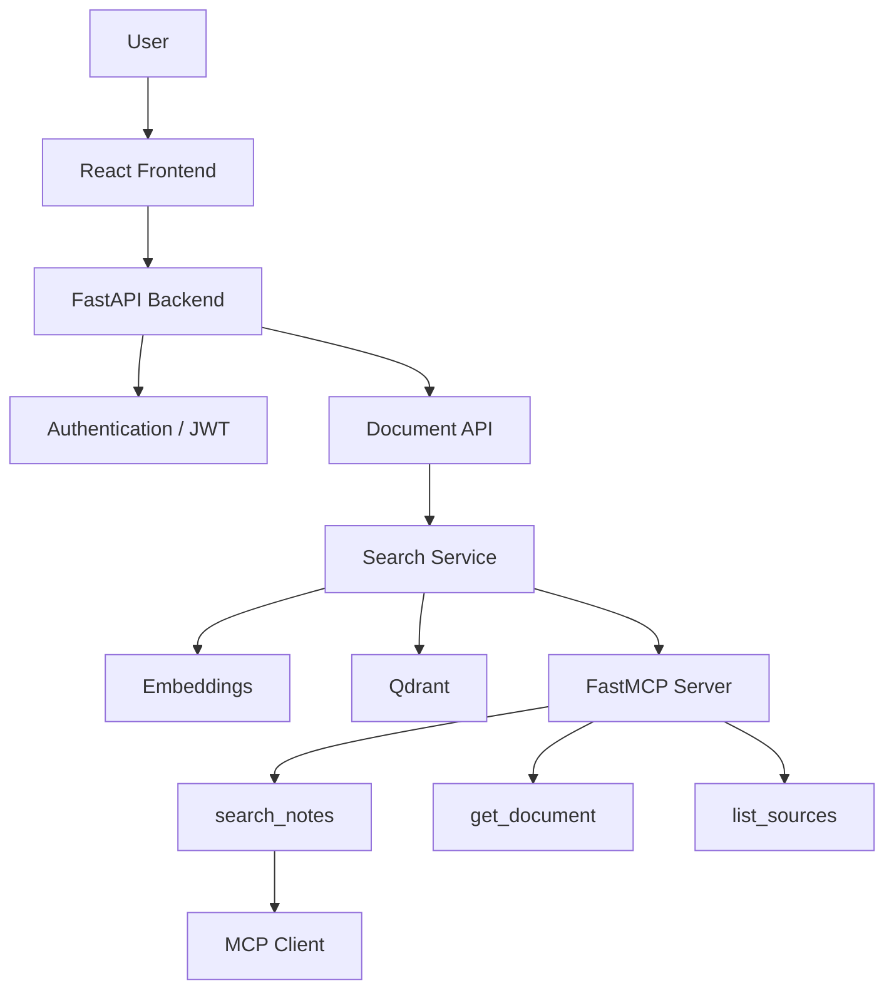

# Personal Knowledge Base MCP

A multi-user personal knowledge base powered by semantic search, Qdrant, FastAPI, and FastMCP, exposing document search through MCP tools to any MCP-compatible AI client.

## Overview

Upload your own documents (PDF, TXT, Markdown, DOCX, PPT/PPTX), and search across them with natural-language queries using semantic (vector) search. Each user's documents and search results are fully isolated from other users. An MCP server exposes the same search capability as tools (`search_notes`, `get_document`, `list_sources`) so any MCP-compatible client (e.g. Claude Desktop) can query your knowledge base directly.

## Architecture



The `SearchService` (`backend/app/services/search_service.py`) is the single shared
implementation used by both the `/search` HTTP route and the MCP tools — there is
no duplicated Qdrant logic between the two.

## Data flow

```
Documents (PDF/TXT/MD/DOCX/PPTX)
       ↓
Text Extraction (loader.py)
       ↓
Chunking (chunker.py)
       ↓
Embeddings (embedder.py, all-MiniLM-L6-v2)
       ↓
Qdrant (per-user filtered vector store)
       ↓
Semantic Search (search_service.py)
       ↓
FastAPI  /  FastMCP tools
       ↓
Frontend  /  MCP Client
```

## Folder structure

```
personal-knowledge-base-mcp/
├── backend/
│   ├── app/
│   │   ├── main.py                # FastAPI app, router registration, CORS
│   │   ├── api/
│   │   │   ├── auth.py            # /auth/register, /auth/login, /auth/me
│   │   │   ├── documents.py       # /documents (upload/list/get/delete)
│   │   │   └── search.py          # /search
│   │   ├── core/
│   │   │   ├── config.py          # Settings (env-driven)
│   │   │   ├── database.py        # SQLAlchemy engine/session
│   │   │   ├── dependencies.py    # get_current_user
│   │   │   └── security.py        # password hashing, JWT
│   │   ├── models/
│   │   │   ├── user.py
│   │   │   ├── document.py
│   │   │   └── knowledge.py
│   │   ├── ingestion/
│   │   │   ├── loader.py          # text extraction (pdf/docx/pptx/txt/md)
│   │   │   ├── chunker.py         # paragraph-aware chunking
│   │   │   ├── embedder.py        # SentenceTransformer wrapper
│   │   │   └── processor.py       # glues extract -> chunk -> embed -> store
│   │   ├── database/
│   │   │   └── qdrant_client.py   # Qdrant manager, per-user filtering
│   │   └── services/
│   │       └── search_service.py  # single shared search implementation
│   ├── mcp_server/
│   │   ├── server.py              # FastMCP app + tool registration
│   │   ├── tools.py                # MCP tool layer -> SearchService
│   │   └── schemas.py
│   ├── tests/
│   │   ├── test_api.py            # auth/documents/search/isolation
│   │   ├── test_mcp_tools.py      # MCP tool layer
│   │   ├── test_seperate.py       # manual ingestion smoke test
│   │   └── sample.txt
│   ├── requirements.txt
│   └── .env.example
└── frontend/
    ├── src/
    │   ├── api/client.js          # backend API client (fetch + token handling)
    │   ├── components/RequireAuth.jsx
    │   ├── pages/                 # Login, Register, Dashboard, Upload, Documents, Search, SearchResults
    │   ├── styles/
    │   ├── App.jsx
    │   └── main.jsx
    ├── index.html
    └── vite.config.js
```

## Installation

### Backend

```bash
cd backend
python -m venv .venv
source .venv/bin/activate   # Windows: .venv\Scripts\activate
pip install -r requirements.txt
cp .env.example .env        # then edit SECRET_KEY etc.
```

### Frontend

```bash
cd frontend
npm install
```

## Environment setup

Copy `backend/.env.example` to `backend/.env` and adjust as needed. Never commit `.env`.

Key variables:
- `SECRET_KEY` — set a real random secret in production.
- `QDRANT_IN_MEMORY=true` — good for local dev/demo (no persistence across restarts). Set to `false` and configure `QDRANT_HOST`/`QDRANT_PORT` to use a real Qdrant server.
- `SEARCH_SCORE_THRESHOLD` — minimum similarity score for a result to count as a confident match.

## Qdrant setup (optional, for persistence)

By default the app runs Qdrant in in-memory mode — nothing to install, but data is lost on restart. To persist data:

```bash
docker run -p 6333:6333 qdrant/qdrant
```

Then set `QDRANT_IN_MEMORY=false` in `.env`.

## Running the application

**Backend:**
```bash
cd backend
uvicorn app.main:app --reload --port 8000
```

**Frontend:**
```bash
cd frontend
npm run dev
```
Visit `http://localhost:5173`.

## Running the MCP server

```bash
cd backend
python -m mcp_server.server
```

This starts the FastMCP server exposing `search_notes`, `get_document`, and `list_sources` for any MCP-compatible client to connect to.

## Testing

```bash
cd backend
pytest tests/test_api.py -v
pytest tests/test_mcp_tools.py -v
python tests/test_seperate.py   # manual ingestion smoke test
```

> Note: tests that perform real embedding/search download `all-MiniLM-L6-v2` from Hugging Face on first run — an internet connection is required the first time.

## MCP tools

| Tool | Description |
|---|---|
| `search_notes(user_id, query, top_k)` | Semantic search over the user's documents. Returns ranked chunks with filename/score, or a "No confident match found." message. |
| `get_document(user_id, doc_id)` | Retrieves the full reconstructed content of one document owned by the user. |
| `list_sources(user_id)` | Lists all documents belonging to the user. |

## Example usage

```bash
curl -X POST http://localhost:8000/auth/register \
  -H "Content-Type: application/json" \
  -d '{"username":"alice","email":"alice@example.com","password":"secret123"}'

curl -X POST http://localhost:8000/auth/login \
  -H "Content-Type: application/json" \
  -d '{"email":"alice@example.com","password":"secret123"}'
# -> { "access_token": "...", ... }

curl -X POST http://localhost:8000/documents/upload \
  -H "Authorization: Bearer <token>" \
  -F "file=@notes.pdf"

curl -X POST http://localhost:8000/search \
  -H "Authorization: Bearer <token>" \
  -H "Content-Type: application/json" \
  -d '{"query": "What are the four principles of OOP?", "top_k": 5}'
```

## Retrieval evaluation

Hand-label queries in `backend/tests/test_queries.json` (mapping each query to its expected source document), run them against `/search`, and compute Precision@K. See `evaluation_results.md` for the results template.

## Multi-user security

User isolation is enforced at multiple layers, not just the UI:
- Every document/search DB query is scoped with `WHERE user_id = <current_user>`.
- Every Qdrant query includes a `user_id` filter condition, so vector search can never surface another user's chunks even if a document_id were guessed.
- `tests/test_api.py::test_user_isolation_documents_and_search` verifies this end-to-end.

## Team contribution structure

| Member | Area |
|---|---|
| Member 1 | MCP server / tools (`backend/mcp_server/`) |
| Member 2 | Document processing + Qdrant (`backend/app/ingestion/`, `backend/app/database/`) |
| Member 3 | FastAPI backend + auth (`backend/app/api/`, `backend/app/core/`) |
| Member 4 | Frontend + testing + evaluation (`frontend/`, `backend/tests/`) |